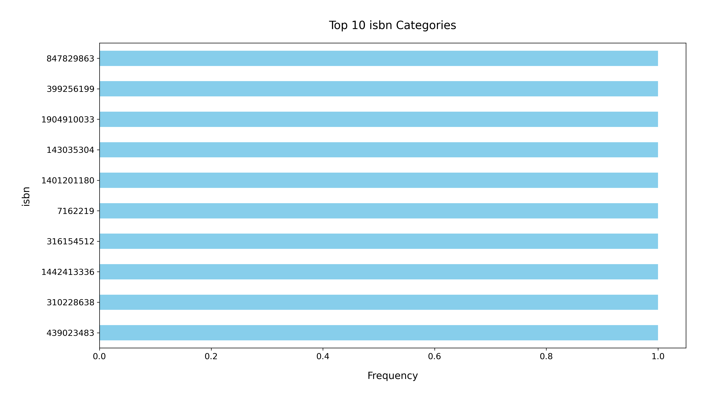

# Analysis Report

### Summary of the Goodreads Dataset

The dataset, `goodreads.csv`, contains 10,000 entries and 23 columns, offering detailed information about books. Key fields include book identifiers, authors, publication years, ratings, review counts, and images. However, the dataset includes missing values in some critical columns, such as ISBN numbers, original titles, and language codes.

---

### Key Findings

#### 1. Missing Values
- **Critical Fields:** Missing values are notable in ISBNs (7%), ISBN13 (5.85%), and original titles. Language codes are missing for 10.84% of entries, potentially limiting multilingual analyses.

#### 2. Publication Year
- The average original publication year is 1982, with a maximum year of 2017. This highlights a mix of classic and contemporary literature.

#### 3. Authors
- There are 4,664 unique authors. Stephen King appears most frequently (60 times), showcasing his popularity among readers.

#### 4. Ratings
- The average book rating is **4.00**, with a standard deviation of **0.25**, indicating predominantly positive feedback. The highest recorded rating is **4.82**.

#### 5. Ratings Count
- The average ratings count per book is **54,001**, ranging from **2,716** to **4,780,653**, reflecting varied levels of reader engagement.

#### 6. Reviews
- Each book has an average of **2,920** text reviews, suggesting robust user interaction. However, the range indicates significant variability in review volumes.

#### 7. Language Codes
- The majority (63.41%) of books are in English (code: 'eng'), while other languages are underrepresented, which might affect the dataset's diversity.

---

### Recommendations

#### 1. Data Cleaning
- **Resolve Missing Values:** Focus on imputation for ISBNs and language codes or consider excluding entries with excessive missing data.
- **Standardize Entries:** Normalize fields like titles and authors to reduce duplication.

#### 2. Author and Genre Insights
- **Popularity Analysis:** Study the factors contributing to Stephen King’s popularity, such as genre trends and reader demographics.
- **Genre Segmentation:** Identify trends in ratings and reviews across genres for targeted recommendations.

#### 3. User Engagement Analysis
- **Reviews and Ratings:** Investigate the correlation between ratings, reviews, and book sales. 
- **Language Insights:** Explore ways to include more non-English books to enhance representation.

#### 4. Advanced Visualizations
- **Publication Year Trends:** Plot the relationship between publication year and ratings to visualize historical trends.
- **Reader Engagement:** Create heatmaps to analyze the interplay between ratings count, reviews, and user feedback.

---

### Visualization Analysis

#### Top ISBN Categories (Bar Plot)
The chart highlights the top 10 ISBN categories with the highest frequency:

1. 647829863
2. 399256199
3. 1904910033
4. 143035304
5. 1401180200
6. 7162219
7. 316154512
8. 1442413336
9. 310226638
10. 439023483

##### Observations:
- The first three ISBN categories have slightly higher frequencies than the rest, reflecting their prominence.
- Analyzing these ISBNs further can reveal patterns in popularity or publisher trends.

#### Correlation Heatmap of Goodreads Features

The heatmap visualizes relationships between numerical variables:

##### Key Observations:

1. **Positive Correlations:**
   - Strong links between `ratings_count`, `work_ratings_count`, and `work_text_reviews_count` suggest that higher engagement correlates with better ratings.

2. **Negative Correlations:**
   - A negative relationship exists between `books_count` and average ratings, possibly due to series dilution effects.

3. **Weak Correlations:**
   - Features like `isbn13` and `original_publication_year` have limited influence on other variables.

##### Recommendations:
- Use correlation analysis to select features for predictive modeling.
- Investigate clustering among strongly correlated variables for enhanced insights.

---

### Visualizations

1. **Top ISBN Categories Bar Chart**
   - 

2. **Correlation Heatmap**
   - 

