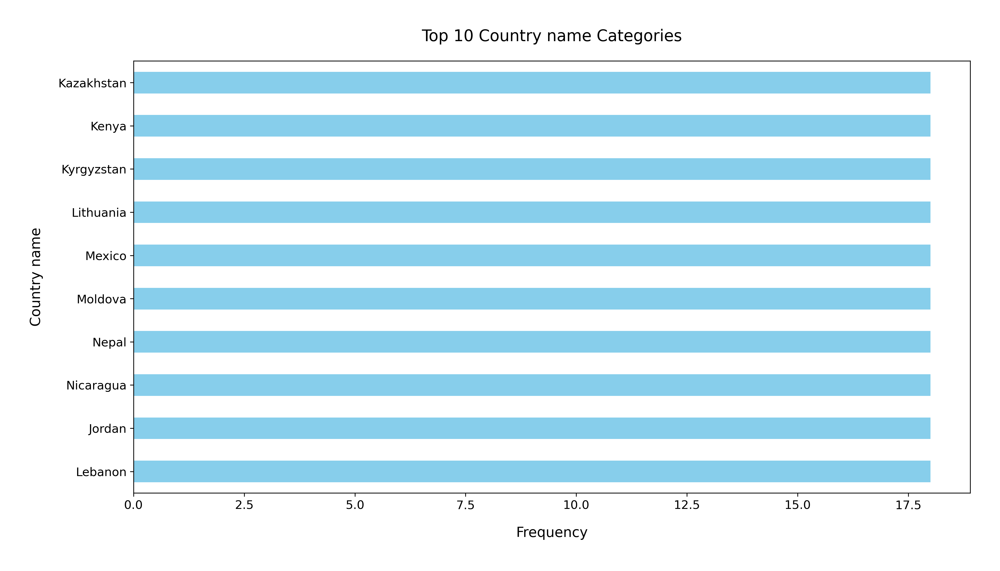
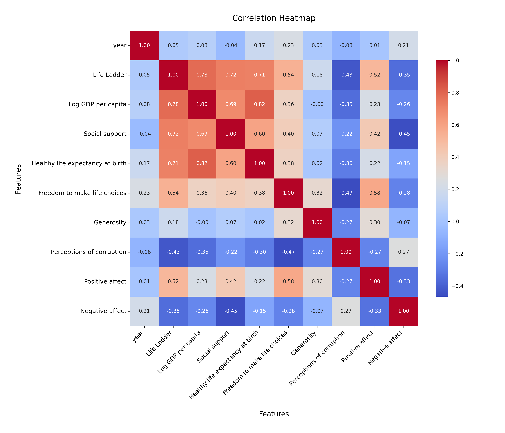

# Analysis Report

### Summary of the Happiness Dataset

The dataset contains 2,363 entries and 11 columns, capturing various factors related to happiness across different countries from the year 2005 to 2023. Key indicators include GDP per capita, social support, healthy life expectancy, personal freedom, generosity, and perceptions of corruption.

### Key Findings

#### 1. Missing Values
- The dataset has several missing values, particularly in:
  - **Generosity:** 81 missing entries.
  - **Perceptions of Corruption:** 125 missing entries.
  - **Healthy Life Expectancy at Birth:** 63 missing entries.
- These missing values may impact analyses and need attention for reliability.

#### 2. Happiness Indicator
- The 'Life Ladder' scores, which indicate overall happiness, have a mean of **5.48** with a standard deviation of **1.13**. 
- The minimum score is **1.281**, indicating significant disparities in happiness levels among countries.

#### 3. Economic Factors
- The average 'Log GDP per capita' is **9.4** with a standard deviation of **1.15**, showing a wide disparity in wealth among the countries.

#### 4. Social Support
- The mean score for 'Social Support' is approximately **0.81**, suggesting that people, on average, feel a strong sense of community and support.

#### 5. Freedom and Corruption
- The average score for 'Freedom to Make Life Choices' is **0.75**.
- The 'Perceptions of Corruption' average is **0.74**, indicating that corruption is perceived as a significant issue globally.

#### 6. Emotional Indicators
- On average, 'Positive Affect' scores **0.65**, while 'Negative Affect' scores are lower at **0.27**, showing a trend toward more positive emotions overall.

---

### Recommendations

#### 1. Address Missing Data
- Use data imputation techniques or focus on subsets with complete data to enhance reliability.

#### 2. Focus on Low Happiness Regions
- Investigate countries with the lowest 'Life Ladder' scores to identify and address root causes of unhappiness.

#### 3. Explore Correlations
- Perform correlation analyses between 'Life Ladder' and other variables such as 'Log GDP per capita,' 'Social Support,' and 'Freedom to Make Life Choices' to identify key drivers of happiness.

#### 4. Policy Recommendations
- Promote policies that enhance social support systems and reduce corruption, as these strongly correlate with happiness.

#### 5. Longitudinal Studies
- Analyze trends over time to understand how socio-economic changes influence happiness.

#### 6. Visualizations
- Use scatter plots, bar charts, and heatmaps to illustrate relationships between happiness and other variables.

---

### Visualization Analysis

#### Top 10 Countries by Frequency (Bar Plot)
The horizontal bar chart displays the top 10 countries by frequency:

1. Kazakhstan
2. Kenya
3. Kyrgyzstan
4. Lithuania
5. Mexico
6. Moldova
7. Nepal
8. Nicaragua
9. Jordan
10. Lebanon

##### Observations:
- The frequencies are relatively similar, with the top three countries having slightly higher counts.
- Further analysis could explore these countries' unique attributes contributing to their frequency.

#### Correlation Heatmap
The heatmap visualizes the relationships between numerical variables:

##### Key Observations:

1. **Positive Correlations:**
   - 'Life Ladder,' 'Log GDP per capita,' 'Social Support,' and 'Healthy Life Expectancy' show strong positive correlations, indicating that wealth, health, and support systems are critical to happiness.

2. **Negative Correlations:**
   - 'Perceptions of Corruption' negatively correlates with 'Life Ladder' and other well-being indicators, emphasizing the adverse impact of corruption on happiness.

3. **Weak or No Correlations:**
   - 'Year' has weak correlations with most variables, suggesting limited temporal trends.

##### Recommendations:
- Focus on strongly correlated features for predictive modeling and insights.
- Investigate the role of generosity and its weak correlation with 'Negative Affect.'

---

### Visualizations

1. **Top Countries Bar Chart**
   - 

2. **Correlation Heatmap**
   - 

