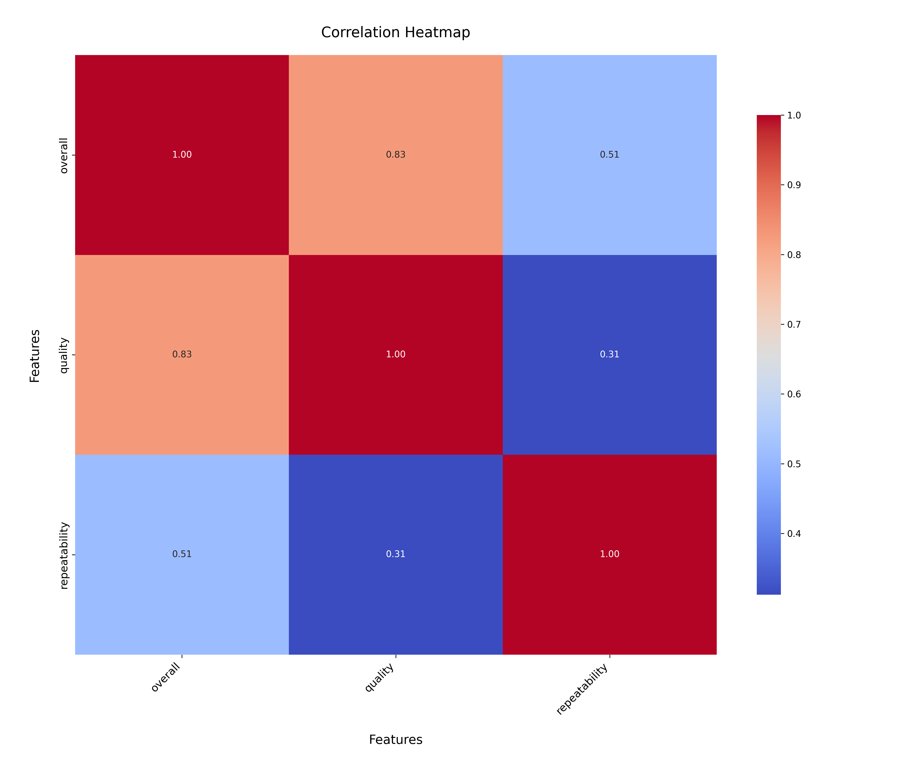

# Media Dataset Analysis Report

## Dataset Summary

The dataset `media.csv` consists of **2,652 entries** and **8 columns**, capturing various attributes of media items. The columns include:

1. **date**: The date associated with the media item.
2. **language**: The language of the media.
3. **type**: The type of media (e.g., movies, shows).
4. **title**: The title of the media item.
5. **by**: The creator or contributor of the media.
6. **overall**: A numerical rating of the media.
7. **quality**: A numerical assessment of the media's quality.
8. **repeatability**: An indicator of how often the media can be revisited or rewatched.

### Missing Values
The dataset contains missing values in the following columns:
- **date**: 99 missing entries
- **by**: 262 missing entries

### Summary Statistics
- **Language**: English is the most prevalent language, accounting for **1,306 entries** (~49%).
- **Type**: Movies dominate the dataset with **2,211 entries** (~83%).
- **Overall Ratings**: Average overall rating is approximately **3.05** (std. dev. 0.76).
- **Quality Ratings**: Mean quality rating is about **3.21**.
- **Repeatability**: Average repeatability score is **1.49**, with a majority rated as 1.

## Key Insights

1. **Language Distribution**: The dataset is primarily **English-centric**, potentially limiting insights for non-English media.
2. **Prevalent Media Type**: Movies dominate the dataset, suggesting strong applicability to the film industry.
3. **Rating Trends**: 
   - Favorable overall and quality ratings suggest positive reception.
   - Low repeatability scores highlight potential for enhancing media engagement strategies.
4. **Missing Values**: Gaps in **date** and **by** columns may bias analyses and hinder creator-specific evaluations.

## Recommendations

1. **Data Cleaning**:
   - Address missing values using imputation methods or exclude incomplete entries.
   - Ensure consistency in columns like **date** and **by**.

2. **Expand Language Diversity**:
   - Include more non-English media to diversify insights.
   - Analyze viewing trends across different demographics for broader applicability.

3. **Enhance Engagement**:
   - Investigate low repeatability scores.
   - Develop strategies like curated playlists or recommendation algorithms to boost revisits.

4. **Further Analysis**:
   - Explore correlations between **type**, **quality**, and **overall ratings** for actionable insights.
   - Use regression models or clustering to understand underlying factors.

5. **Visualizations**:
   - Employ charts (e.g., histograms, box plots) to visualize data distributions.
   - Utilize a bar chart to highlight top 10 date categories by frequency.

### Frequency Distribution of Top Dates

Analysis of top 10 date categories shows similar frequencies among the top dates, with slight variations for the most frequent ones. Exploring the characteristics of these dates can yield deeper insights into media trends.

### Correlation Analysis

Key correlations:
- **Overall, Quality, Repeatability**: Strong positive correlations suggest interconnectedness.
- Insights indicate that quality and repeatability significantly impact overall ratings.

## Implications

- **Content Strategy**: Focus on improving quality and repeatability to enhance user satisfaction.
- **Audience Analysis**: Use insights to tailor offerings based on prevalent media types and language preferences.
- **Data Enrichment**: Collect more granular data on missing entries to enable deeper creator-specific and temporal analyses.

By implementing these recommendations, stakeholders can derive actionable insights to optimize media offerings and better understand consumer preferences.
